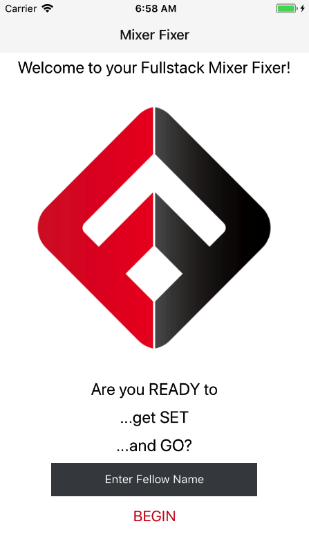
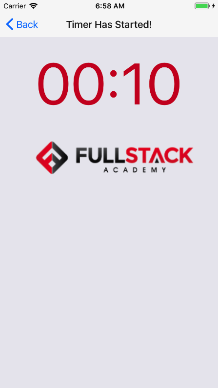

# Welcome to _Mixer Fixer_

[YouTube LIVE Demo] (https://www.youtube.com/watch?v=3Z5y1CEAOWI)

This React-native iOS app uses Socket.io to solve Fullstack Academy's problem of synchronizing time between remote teams for teaching fellows.

Created over a 4-day stackathon period, this project uses Socket.io and Socket.io-client as dependencies.  It uses Express + UUID for the backend management, and React-native + StackNavigator for the frontend.

While originally designed as a party game solution, this app has real world classroom applications in allowing remote teams the ability to sync up a START-GO with a digital timer. (i.e. proctoring an exam, keeping time in practicing whiteboard interviews, and timed brainstorming sessions)

## Background

Every 7 weeks, Fullstack Academy holds a Mixer where Juniors and Seniors can come together and socially bond through playful games of charades with teaching fellows as group leaders.

As a Senior at Fullstack Academy, I have participated in 2 Fullstack Mixers.  I was inspired to create a digital solution to streamline the game process.

### The Problem

Are you a teaching fellow who feels frustrated at the chaos of the Fullstack Mixer?  Are you sick of shouting out 'READY' each round, only to find out that the timer has already started?  Are you confused how much time is left -- because while you're playing in Haskell, the projected countdown timer is in the Oasis room?

Say HELLO to the MIXER FIXER!

## Specs

This project was bootstrapped with [Create React Native App](https://github.com/react-community/create-react-native-app).

For demo purposes, the current timer is set to 10 seconds, but you can customize the time in components/Countdown.js (Line 10).  The unit of measurement is in milliseconds.

While this project has been published on Expo, it has not yet been deployed to a remote server (e.g. Heroku).  However, once started locally, the server is listening with process.env.PORT set to default OR port 1337.

## Housekeeping & Updating to New Releases

Currently, React Native does not support npm version 5.x+.
I recommend using a Node/NPM version manager like 'n'.
Simply run `npm install -g n` to install 'n' globally.
Running the following commands will tell you what versions you currently have:
```
node -v
npm -v
```
You should see node version v7.7.4 and npm 4.1.2 if you run `sudo n 7.7`.
If you ever want to switch back to the latest version (or you just want to update to the latest version) just run `sudo n latest`.

In the development process, I also recommend using Expo's iOS & Android simulator for quick feedback and testing.

You should only need to update the global installation of `create-react-native-app` very rarely, ideally never.

Updating the `react-native-scripts` dependency of your app should be as simple as bumping the version number in `package.json` and reinstalling your project's dependencies.

## Available Scripts

If Yarn was installed when the project was initialized, then dependencies will have been installed via Yarn, and you should probably use it to run these commands as well. Unlike dependency installation, command running syntax is identical for Yarn and NPM at the time of this writing.

### `npm start`

`Concurrently` runs your app in development mode with `npm run server` and `npm run ios` for the packager/compiler.

### `npm run react`

Open it in the [Expo app](https://expo.io) on your phone to view it. It will reload if you save edits to your files, and you will see build errors and logs in the terminal.

Sometimes you may need to reset or clear the React Native packager's cache. To do so, you can pass the `--reset-cache` flag to the start script:

```
npm start -- --reset-cache
# or
yarn start -- --reset-cache
```

### `npm run ios`

Like `npm start`, but also attempts to open your app in the iOS Simulator if you're on a Mac and have it installed.

### `npm run server`

Runs the server only using nodemon.

### `npm test`

Runs the [jest](https://github.com/facebook/jest) test runner on your tests.

## Writing and Running Tests

This project is set up to use [jest](https://facebook.github.io/jest/) for tests. You can configure whatever testing strategy you like, but jest works out of the box. Create test files in directories called `__tests__` or with the `.test` extension to have the files loaded by jest. See the [the template project](https://github.com/react-community/create-react-native-app/blob/master/react-native-scripts/template/App.test.js) for an example test. The [jest documentation](https://facebook.github.io/jest/docs/en/getting-started.html) is also a wonderful resource, as is the [React Native testing tutorial](https://facebook.github.io/jest/docs/en/tutorial-react-native.html).

## iPhone 6S Screenshots




